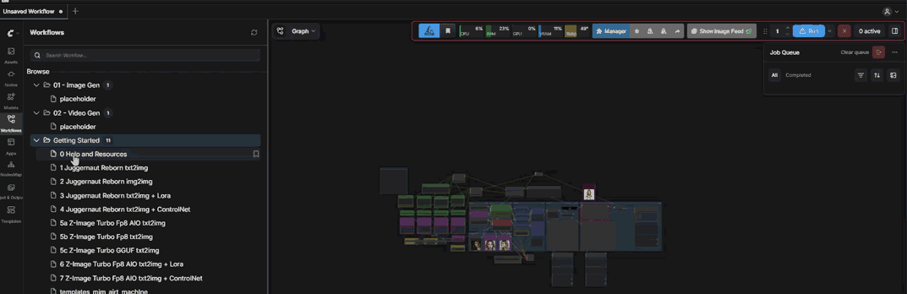

# ComfyUI-WorkflowOrganizer

Adds **drag-and-drop** to the Workflows sidebar in ComfyUI. Drag workflow files onto folders to move them — no page refresh needed.

> A [CraftopiaStudio](https://github.com/CraftopiaStudio) extension.




---

## Features

- Drag `.json` workflow files onto any folder in the sidebar
- Uses ComfyUI's built-in `/userdata/move` API — no filesystem hacks
- Toast notifications on success/failure
- Visual drop highlights on folders
- Zero dependencies, zero Python nodes

---

## Installation

**Via ComfyUI Manager** *(recommended)*
Search for `WorkflowOrganizer` in the Manager and install.

**Manual**
```bash
cd ComfyUI/custom_nodes/
git clone https://github.com/CraftopiaStudio/ComfyUI-WorkflowOrganizer.git
```

Restart ComfyUI. That's it.

---

## Requirements

- ComfyUI **v0.3.0+** (needs the `/userdata/{file}/move/{dest}` endpoint, merged Nov 2024)

---

## How It Works

The extension injects a small JavaScript file that:

1. Finds the Workflows sidebar panel
2. Makes workflow files draggable
3. Makes folders accept drops
4. Calls `POST /userdata/{source}/move/{dest}` when you drop a file on a folder
5. Shows a toast confirmation

---

## Known Limitations

- This is a **v0.1 prototype** — the sidebar DOM structure may change between ComfyUI frontend versions
- Currently only works with the default Workflows sidebar (not third-party panels)
- Nested moves (folder → folder) are not yet supported

---

## License

MIT
