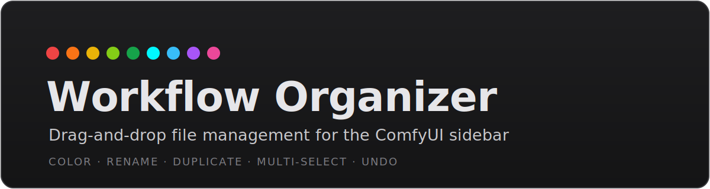

<p align="center">
  
</p>

# ComfyUI-WorkflowOrganizer

Turn the ComfyUI **Workflows sidebar** into a proper file manager. Drag &
drop, color-coding, multi-select, rename, duplicate, and a clean custom
right-click menu — all without a single page refresh.

> A [CraftopiaStudio](https://github.com/CraftopiaStudio) extension.

---

## ✨ Features

- **Drag & drop** workflows *and* folders to reorganize — instantly, no reload
- **Custom right-click menu** for files and folders: Rename, Duplicate,
  Move to…, Set Color, New Folder, Delete
- **Color-coding** for both folders and workflow files, with filled folder icons
- **Multi-select** (Ctrl / Shift) with bulk move and bulk delete
- **Undo** for moves and deletes
- **Colors follow their files** when you move or rename them
- **Duplicate** creates a real file copy on disk (not a throwaway tab)
- Styled confirm dialogs that match ComfyUI's dark theme
- Multi-user aware · zero dependencies · **no custom nodes**

---

## 🎬 In action

### Drag & drop
Drag workflows and whole folders (with their contents) anywhere — drop onto a
folder to nest, or onto the root bar to move out. The sidebar updates instantly.

https://github.com/user-attachments/assets/71904d97-f604-4cd3-a4e7-3b67ed562bd4

### Multi-select + bulk actions
**Ctrl + click** to pick individual workflows, **Shift + click** to select a
range. Then move or delete the whole selection at once (with undo).

https://github.com/user-attachments/assets/ba43ccbf-c974-4b31-b51e-4d377b290993

### Workflow menu
Right-click any workflow for Rename, Duplicate, Move to…, Set Color, New Folder
and Delete — all acting on the file itself, with undo on delete.

https://github.com/user-attachments/assets/d556ed72-c72b-482e-b059-6a0155b4c8db

### Folder menu
The same clean menu for folders: Rename, Duplicate, Move to…, Set Color,
New Folder, New Sub Folder, and Delete (with undo).

https://github.com/user-attachments/assets/accbc381-6177-4eb6-bb19-c1d46d5be121

### Folder colors
Color folders from a palette of presets or a custom gradient/hex picker. Toggle
filled folder icons, or apply one color to every folder at once.

https://github.com/user-attachments/assets/23e6c8aa-037a-4c40-a436-7bedb64b3783

### File colors
Color individual workflow icons with the same picker. Colors are saved and even
follow a workflow when you move or rename it.

https://github.com/user-attachments/assets/5ebb165d-6d81-425f-8442-8bd3ce45fc4a

---

## 📦 Installation

**Via ComfyUI Manager** *(recommended)*
Search for `WorkflowOrganizer` in the Manager and install.

**Manual**
```bash
cd ComfyUI/custom_nodes/
git clone https://github.com/CraftopiaStudio/ComfyUI-WorkflowOrganizer.git
```

Restart ComfyUI. That's it.

---

## ✅ Requirements

- ComfyUI **v0.3.0+** (uses the built-in `/userdata/{file}/move/{dest}` endpoint)

---

## 🧠 How it works

The extension adds a small JavaScript layer plus a few lightweight Python
endpoints (no custom nodes). It:

1. Hooks into ComfyUI's Workflows sidebar tree
2. Makes workflows and folders draggable, and folders drop targets
3. Renders its own context menu and color picker over the sidebar
4. Performs file operations through ComfyUI's `/userdata` API and its own
   `/wfo/*` helper endpoints (create / rename / copy / trash folders & files)
5. Stores colors in a hidden `.wfo_meta.json` in your user folder, so they
   survive renames and moves

The real state always lives on disk — nothing is faked in the DOM.

---

## License

MIT
